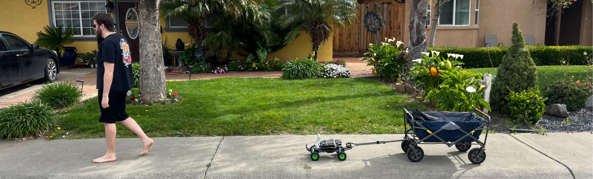

# A.R.M.S. - Autonomous Rover for Mobile Support

**Primary Contact:** _**Jackson Vaughn (**_**[jvaughn@ucdavis.edu](mailto:jvaughn@ucdavis.edu))**

_**Omri Steinberg-Tatman / Brooke O'Flaherty / Luke Patrick Jones**_

**[ost@ucdavis.edu](mailto:ost@ucdavis.edu) / [kelpiekrisps@gmail.com](mailto:kelpiekrisps@gmail.com) / [lpjones@ucdavis.edu](mailto:lpjones@ucdavis.edu)**

## Overview

A.R.M.S. (Autonomous Rover for Mobile Support) represents a groundbreaking step forward in personal mobility assistance, developed by a team of engineering students at the University of California, Davis. In an era where students and professionals alike are burdened by the weight of their daily necessities, A.R.M.S. offers a smart, efficient, and hands-free solution to alleviate this strain. At its core, the project transforms a Traxxas R.C. car into a semi-autonomous rover, capable of following its owner with precision, thanks to advanced robotics, machine learning, and real-time data processing technologies.

Equipped with a powerful Nvidia Jetson TX2 module and an Intel RealSense camera, A.R.M.S. leverages Nvidia’s trt_pose model for state-of-the-art real-time pose estimation. This enables the rover to interpret a range of user poses, turning simple gestures into commands that guide its movement. The result is a seamless interaction between human and machine, offering a glimpse into the future of personal robotic assistants.



## Features

### Autonomous User Following

A.R.M.S. stands out for its ability to autonomously navigate complex environments while maintaining a constant follow distance from its user. Using the Intel RealSense camera for depth sensing and the Nvidia Jetson TX2 for processing, the rover dynamically adjusts its path to avoid obstacles and keep the user in sight, ensuring a smooth and safe experience.

### Intuitive Pose-Based Control

Beyond mere following, A.R.M.S. introduces a novel method of interaction through pose detection. By adopting specific stances, such as the T-Pose for activation or the S-Pose for pause, users can control the rover without the need for handheld devices. This feature not only adds to the convenience but also enriches the user experience by making technology more accessible and fun.

### Real-Time Responsiveness

At the heart of A.R.M.S.’s performance lies its capability to operate at near-real-time frame rates. Achieving around 20 frames per second, the system provides immediate feedback to user commands and environmental changes. This responsiveness is crucial for maintaining an organic and reliable interaction between the rover and its user, ensuring that A.R.M.S. can adapt on-the-fly to varying conditions.

### Advanced Safety Features

User safety is a paramount concern in the design of A.R.M.S. The system incorporates intelligent braking and distance management to prevent collisions. If the rover detects that the user is too close or out of the camera's field of view, it automatically comes to a stop. This feature guarantees a safe operating distance between the rover and its user at all times.

### Scalability and Future Improvements

The A.R.M.S. project lays a solid foundation for future enhancements, including the implementation of variable following distances and the integration of Multi-Object Tracking and Segmentation (MOTS). These potential upgrades promise to make A.R.M.S. even more versatile and suited to a wider range of applications, from educational settings to industrial and commercial environments.

## Getting Started

Instructions on how to setup and run A.R.M.S. will be provided here. This section will cover prerequisites, installation steps, and how to initiate the rover's autonomous following and pose detection functionalities.

### Rover Setup
For all rover hardware-related setup, please follow JetsonHack's fantastic [tutorial](https://youtube.com/playlist?list=PLXYLzZ3XzIbi3djynrdC1ofn-54WpIFbN&si=Gd9gv46p8KPnPF1Y).

### Installing trt_pose
These instructions are based on Nvidia's guide. For more information, please refer [here](https://github.com/NVIDIA-AI-IOT/trt_pose).
#### Step 1 - Install Dependencies
Install PyTorch and Torchvision. To do this on NVIDIA Jetson, we recommend following [this guide](https://forums.developer.nvidia.com/t/pytorch-for-jetson/72048).

Install [torch2trt](https://github.com/NVIDIA-AI-IOT/torch2trt)
```bash
   git clone https://github.com/NVIDIA-AI-IOT/torch2trt
   cd torch2trt
   sudo python3 setup.py install --plugins
```

Install other miscellaneous packages
```bash
   sudo pip3 install tqdm cython pycocotools
   sudo apt-get install python3-matplotlib
```
#### Step 2 - Install trt_pose
```bash
   git clone https://github.com/NVIDIA-AI-IOT/trt_pose
   cd trt_pose
   sudo python3 setup.py install
```

### Install other needed packages
```bash
   pip3 install Adafruit-Blinka
   pip3 install cv2
```

## Usage

Interacting with A.R.M.S. is designed to be intuitive, relying on specific body poses to control the rover's actions. Below are the instructions on how to start the rover, control it, and stop it using pose commands:

### Starting the Rover

To activate A.R.M.S. and begin the following mode:

1. Stand with your body visible to the rover's camera.
2. Extend both arms straight out to your sides, forming a 'T' shape with your body.
3. Ensure your arms are parallel to the ground - this is recognized as the T-Pose.
4. The rover will process your pose and start to follow you once it recognizes the T-Pose.

### Controlling the Rover

Once activated, A.R.M.S. will autonomously follow the user. Ensure you maintain a clear path for the rover to avoid any obstacles.

### Stopping the Rover

To stop the rover:

1. Raise one arm to form a right angle, with your hand pointing upwards.
2. Lower the other arm to form a right angle, with your hand pointing downwards.
3. The rover will recognize the S-Pose and come to a stop.

Remember that A.R.M.S. has been designed with user safety as a priority. If you need to halt the rover immediately for any reason, transition to the S-Pose. Make sure to perform the poses clearly so the rover's camera system can detect them accurately for optimal responsiveness. However, A.R.M.S. does have an auto-braking feature to avoid any collisions with the user. 


## Acknowledgments

We extend our gratitude to Professor Chuah for her invaluable guidance throughout this project. Special thanks to Kartik Patwari for technical support and the ECE Department of The University of California, Davis, for providing the necessary funding. Their collective support was instrumental in the realization of A.R.M.S.

## Contributors

- Omri Steinberg-Tatman
- Jackson Vaughn
- Brooke O'Flaherty
- Luke Jones

For any inquiries or contributions, please contact us through our email addresses.

## References
- Nvidia-Ai-IoT. “TRT POSE: Real-Time Pose Estimation Accelerated with Nvidia TENSORRT.” GitHub.
- “Jetsonhacks - Overview.” GitHub.
- “Real-Time Human Pose Estimation.” NVIDIA Developer.


